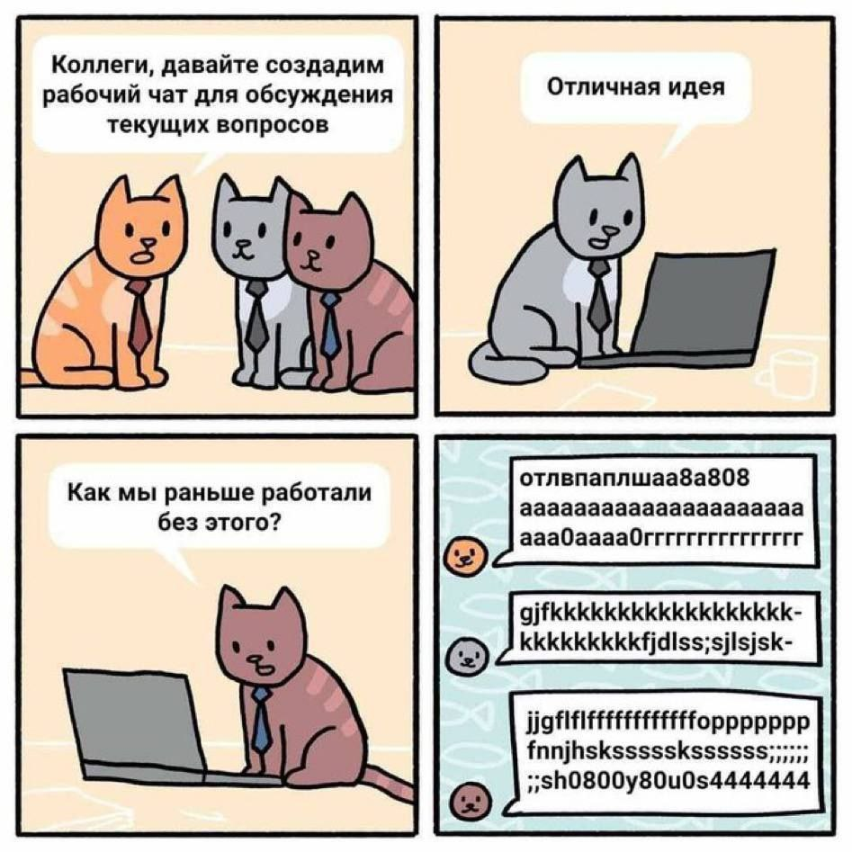
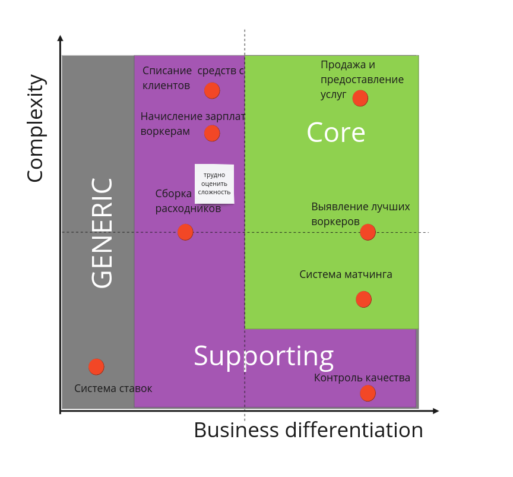
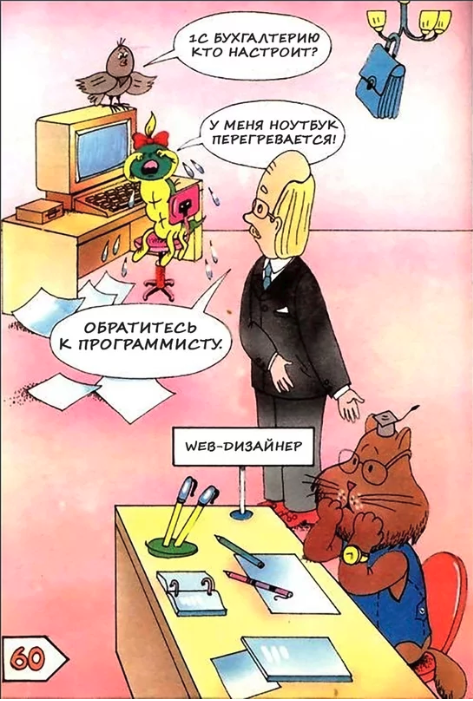
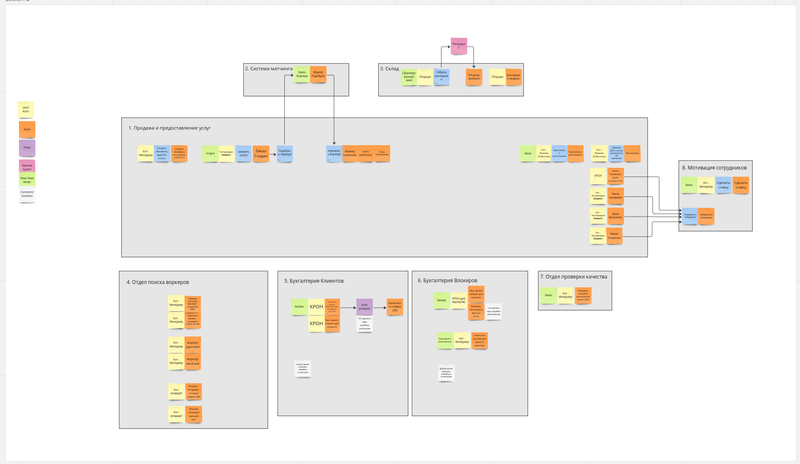
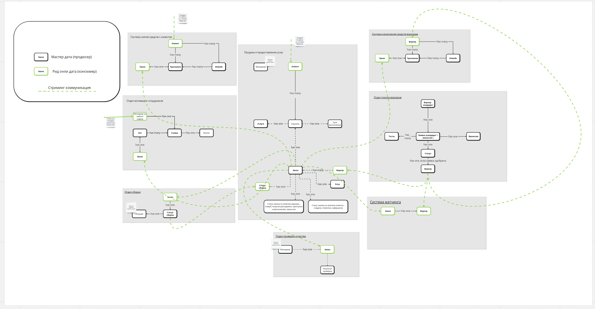
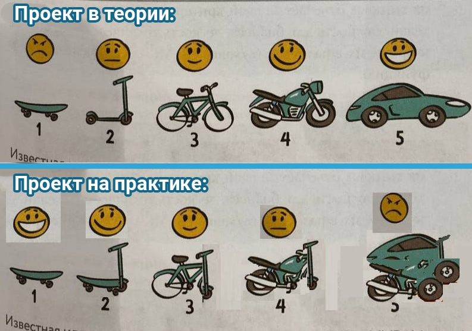
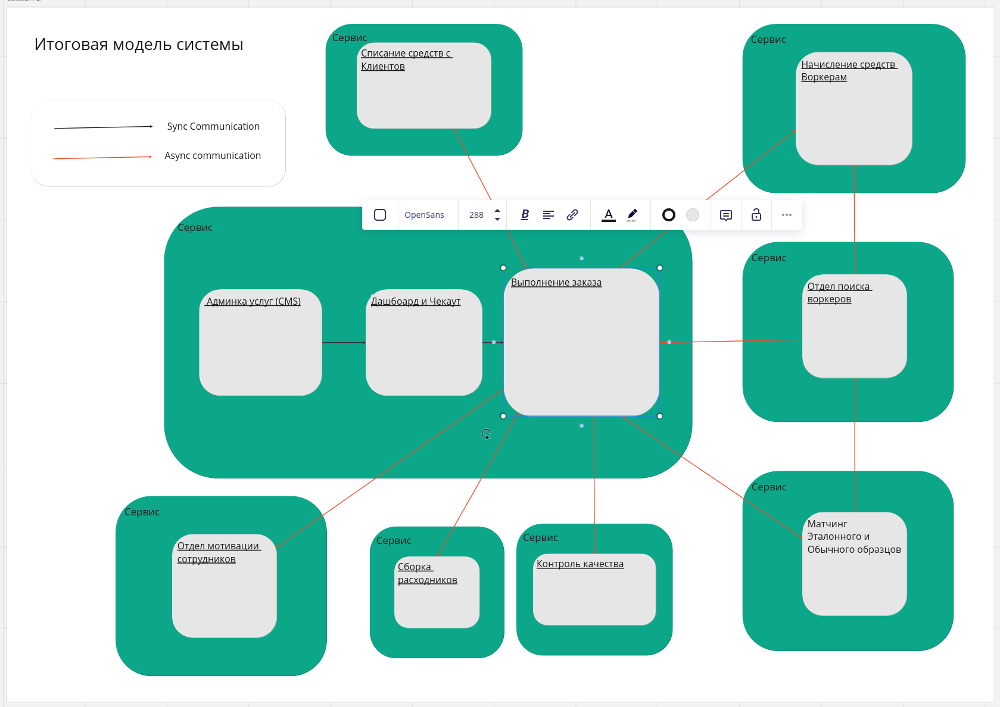

# Домашка №2

## Поддомены

| Поддомен                              | Конк. преимущество | Сложность | Изменчивость |
|---------------------------------------|--------------------|-----------|--------------|
|1. Предоставление услуг                | нет   | Высокая   | Низкая |
|2. Выявление лучших воркеров           | да   | Высокая   | Высокая |
|3. Сборка расходников                  | нет  | Высокая   | Низкая  |
|4. Списание средств с клиентов         | нет  | Низкая   | Низкая  |
|5. Начисление зарплат воркерам         | нет  | Низкая   | Низкая  |
|6. Контроль качества услуг             | нет  | Низкая    | Низкая  |
|7. Мотивация сотрудников               | нет  | Низкая    | Низкая  |
|8. Система матчинга                    | да   | Высокая   | Высокая |

| Поддомен                              |  Вид        | Bounded Context |
|---------------------------------------|-------------|-----------------|
|1. Продажа и предоставление услуг      |  Core       | Создание услуг, заказ услуг, выполнение заказа |
|2. Выявление лучших воркеров           |  Core       | Тестирование кандидатов в воркеры|
|3. Сборка расходников                  |  Supporting | Хранение, пополнение и учет расходников |
|4. Взимание средств с клиентов         |  Supporting | Списание средств с клиентов |
|5. Рассчет с воркерами                 |  Supporting | Оплата средств воркерам |
|6. Контроль качества услуг             |  Supporting | Проверка отменненных и провалленных услуг |
|7. Мотивация сотрудников               |  Generic    | Ставки на результат выполнения услуги |
|8. Система матчнга                     |  Core       | Сопоставление зазаза с воркером |

## Сравнение с первым уроком

По сравнению 1 ES
- Объединил Админку, Чекаут и Выполнение заказа в общую подсистему (Продажа и предоставление услуг)
  Эти элементы практически не имеют смысла друг без друга, так как решают одну бизнес-задачу и не работают друг без друга.
  Видимо так получилось, потому что раньше не думал про бизнес-задачи.
- Раньше также выделял отдельно **историю оказанных услуг**. Сейчас я ее просто убрал, это просто рид-модель. Эту историю можно
  брать из нового объединенного поддмена.
- Добавил поддомен мотивации сотрудников (ставки), просто потому что оказалось, что надо принимать ставки и вести рассчеты не в тетрадке.
- Добавил систему матчинга. Раньше казалось, что она не очень-то и уникальная, но похоже ею занимается отдельный департамент,
  и они используют свои термины. И обещают сильно ее развивать.

Новая версия ES:

Та же ES на [Miro](https://miro.com/app/board/uXjVNN4Acpo=/?share_link_id=207824875375)

Та же Data Model на [Miro](https://miro.com/app/board/uXjVNPGHdGU=/?share_link_id=377061542987)

## Характеристики, важные для проекта:

Низкий TMM:

  - *Agility*,
  - *Testability*
  - *Deployability*

Компания планирует расширяться:

  - *Modifiability*
  - *Scalability*

Компания планирует конкурировать на рынке. И Компания не хочет закрыться с позором после ддос

  - *Scalability*
  - *Availability*
  - *fault tolerance*.

Для бизнеса критично проверять новые гипотезы по отсеву котов и изменять уже существующие с максимальной скоростью и надёжностью

  - *Modifiability*
  - *Maintainability*
  - *Scalability*

## Выводы и итоговая модель

Исходя из того, что нам необходимо легко изменяться и расширяться, а также у нас нет ограничений по средствам,
то опять же выберем микросервисную архитектуру. Сделаем с асинхронными коммуникациями, чтобы лучше обеспечить
*fault tolerance*.

Итоговая модель на [Miro](https://miro.com/app/board/uXjVOzjE5yk=/?share_link_id=751145777650)

