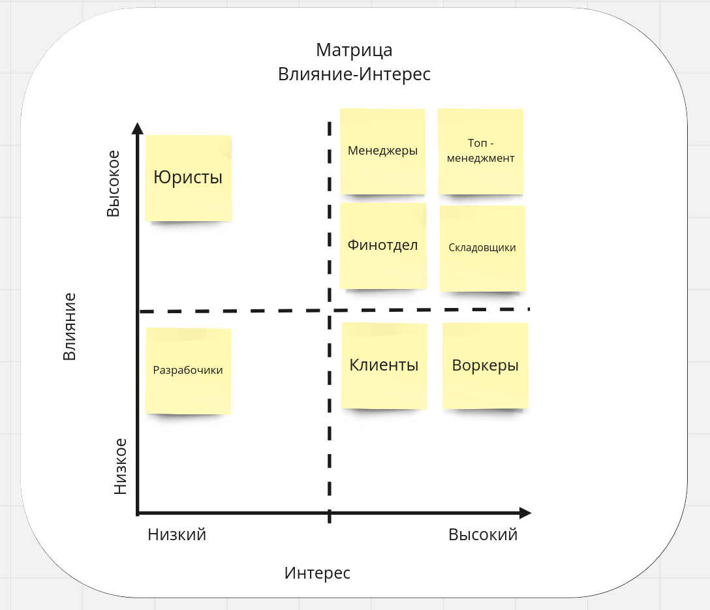

# Домашка №3

## Стейкхолдеры

1. Топ-менеджмент

   - Максимально быстро и гибко проверять новые гипотезы по отсеву котов
   - Логика скоринга сильно выше, чем планировалась
   - Релизный цикл - 1 месяц, для скоринга 1 неделя

1. Менеджеры

   - Хотят, чтобы все было максимально удобно и понятно
   - Хотят чтобы о системе ставок не знали другие менеджеры и разработчики, в том числе топ-менеджмент
   - Система должна выдерживать 10 заказов в минуту

1. Финотдел

   - Хотят, постоянно добавлять новые способы списания для клинетов
   - Хотят, чтобы данные о выплаченных или списанных средствах не терялись и не менялись

1. Разработчики

  - система должна работать без сбоев, а если сбой случается, то должно быть понятно, что и где чинить.

1. Админы

  - Простота мониторинга системы для своевременного замечания сбоев, чтобы не работать в авральном режиме.

1. Клиенты и Воркеры

   -  ожидаемое поведение системы: без сбоев и тупняков.

1. Сотрудники отдела сборки расходников

   - Хотят чтобы на складе было всегда все, что нужно в будущих заказах

1. Юристы

  - Хотят выполнения требований FinTechComplience

## Важные характеристики для поддоменов

1. Для всех

- Maintainability - консерн разработчиков
- Usability  - консерн менеджеров
- Simplicity - консерн менеджеров

1. Предоставление услуг

- Scalability - Консерн менеджеров, исходя из 10 заказов в минуту

1. Выявление лучших воркеров

- Evolvability - Консерн топ менеджеров о гибкой системе выявленя лучших воркеров, тестируя множество гипотез
- Deployability - Должны релизиться раз в неделю, чаще, чем в остальной системе
- Fault tolerance - Опасения о ддос

1. Списание средств с клиентов

- Consistency - Храним платежные данные, нам важно ничего не потерять
- Agility - Можем часто добавлять новые виды плтежных данных
- FinTechComplience - консерн юриста

1. Начисление средств воркерам

- Consistency - Храним платежные данные, нам важно ничего не потерять
- FinTechComplience - консерн юриста

1. Матчинг

- Evolvability - консерн разработчиков о сложном алгоритме, состоящем из многих шагов, похоже на map-reduce
- Modifiability - тот же консерн

1. Склад, Контроль качества, Мотивация сотрудников

- no special concerns

### Картинка не в тему №1

## Выбор архитектурного стиля

Для системы в целом выберем event-driven, как более надежную архитектуру,
позволяющую обеспечить лучшие показатели Evolvability и Scalability для core-поддоменов.

Отдельные сервисы:

1. Мы объединяем поддомены Предоставление услуг и контроля качества в один Modular Monolith.
   Здесь у нас 4 баундед контекста, каждый в своем модуле. Все не очень сложны и не имеют каких-либо
   несопоставимых характеристик.

1. Выявление лучших воркеров - отдельный сервис c Microkernel архитектурой.
   Для проверки гипотез, которые можно создвать как плагины, самое то.

1. Матчинг - отдельный сервис c Pipeline архитектурой.
   Разрабочики говорили, что алгоритм похож на MapReduce, что должно хорошо матчиться с pipeline архитектурой

1. Склад будет отдельным Modular Monolith сервисе. У него отдельная специфика, отдельные менеджеры по складу.
   Cвои проблемы с доставками, заказами, размещением физических товаров и т.п.

1. Списание средств с клиентов - отдельный сервис c layered monolith архитектурой
   Не объединяем с другими сервисами из-за требований FinTechComplience и Consistency. Не объединяем с "Начислением средств для воркеров"
   так как в это сервисе выше Agility, Modifyability. Также на него должна быть выше нагрузка в конце месяца из-за
   большого количества списаний, по сравнению с начислениями. Не хочется рисковать другим бизнес-процессом.

1. Начисление средств воркерам - отдельный сервис c layered monolith архитектурой
   Не объединяем с другими сервисами из-за FinTechComplience и Consistency.

1. Мотивация сотрудников - Может быть накидаю монолит на коленке в свободное время, чтобы иногда получать выигрыш)
   Хотя кого я обманываю, с такими запросами только вылечу с работы и весь проект провалится.
   Поговорю с менеджерами, пусть рассекретят свои планы, и сделаем все как надо.

#### Ссылка на Миро, с [переделанной итоговой моделью](https://miro.com/app/board/uXjVOzjE5yk=/?share_link_id=327194683680) из домашки №2

### Базы данных:

- Для бухгалтерских сервисов обязательно возьмем реляционные БД для обеспечения Consistency.
- Для склада - также возьмем реляционную БД, чтобы не потерять ни одного айтема
- Для выполнения заказов - также возьмем реляционную БД, чтобы не получить заказ, который одновременно и выполнен и отменен.
- Для матчинга - не важно какая будет база. Возьмем реляционную, чтобы не разводить зоопарк технологий. Будем в ней хранить результаты матчинга.
- Для отсева воркеров лучше подойдет документоориентированная база для гибкой структуры под разные плагины и провеки разных гипотез.

### Картинка не в тему №2

## Виды коммуникаций

Для достижения основных характеристик core поддоменов - Evolvability и Scalability,
мы бы хотели, чтобы каждый сервис продолжал работать, когда другие сервисы упали. И вот чтобы не ждать
синхронных ответов, мы будем использовать асинхронные ивенты.

Когда менеджер по кадрам аппрувит нового воркера, мы асинхронно стримим его данные. Этот стрим получают все сервисы в которых используются воркеры.
- сервис для предоставления услуг, чтобы он мог зайти и посмотреть назначенные заказы
- сервис для начисления средств воркеру, чтобы он мог зайти и посмотреть свои заработки
- сервис матчинга для назначения заказов для него

Когда заказ оформляется, мы должны назначить воркера, используя сервис матчинга. Поскольку у нас нет сведений о скорости матчинга, а также нет
ограничений по скорости нахождения воркера, то используем асинхронную коммуникацию в event-driven стиле. В обратную сторону ивент с выбранным воркером также
отправится асинхронно. Если мы будем ждать результата слишком долго, мы на всякий пожарный реализуем какой-то базовый алгоритм матчинга (рэндом) прямо
на сервисе выполнения заказа, чтобы ошибки матчинга не отражались на клиентах.

Когда воркер назначен на заказ, мы должны сообщить о новом заказе в сервис сборки. Сделаем это также асинхронно через ивент, чтобы
не зависеть от ответа склада, моментально нам ответ не нужен.

Когда расходники на заказ собирутся, воркер получит оповещение от склада на почту, и сможет начать выполнение заказа. Нам не нужен ивент, что расходники
собрались.

Когда заказ завершается любым способом (то есть успешно, проваливается или отменяется), мы посылаем ивент, который получают

- Сервис выплат воркерам
- Сервис списания средств с клиента
- Сервис мотивации
- Сервис матчинга (для улучшения матчинга в будущем)

## Фитнес функции для валидации итоговой системы

- unit тесты в каждом сервисе
- интеграциоонное тестирование
- code сoverage
- нагрузочное тестирование
- что какается специфичных монолитных архритектур, надо подобрать специфичные фреймворки и линтеры
- графана с метриками деплоя и другими метриками

### Картинка не в тему №3

## ADR-001: Выбор архитектурного стиля для сервиса отбора воркеров

### **Status:** Accepted

### Context

Основываясь на требованиях и консернах стейкхолдеров, а именно:

- Evolvability - Консерн топ менеджеров о гибкой системе выявления лучших воркеров, включающую тестирование множество гипотез;
- Deployability - Желание топ менеджеров релизиться раз в неделю, что чаще, чем в других сервисах;
- Fault tolerance - Опасения о разных атаках на этот сервис,

было решено вынести реализацию кейса отбора воркеров в отдельный сервис.

### Decision: Monolithic Microkernel Architecture Style

Учитывая то, что нам нужно будет проверять множество гипотез об отсеве воркеров, то нам будет
удобно создавть систему с кор-функционалом и подключаемым функционалом для проверки каждой гипотезы.
Для такой системы мы будем использовать наиболее подходящий Microkernel Architecture Style.

### Decision: Document DB

Поскольку сложно предсказать структуру данных, которая потребуется для подключения и проверки новых гипотез по отсеву воркеров,
то нам было бы крайне сложно работать со строго типизированными реляционными базами данных. Также у нас нет требований к консистентности данных.
Для таких случаев хорошо подходят документоориентированные базы данных.

### Сompliance

- Будем проверять код вручную, чтобы придерживаться выбранного архитектурного стиля.
- Подключим линтеры, или напишем свои дополнения к них, для соблюления соглашений по архитектуре.
- Будем трекать время деплоя для мониторинга желаемой характеристики Deployability.

### Картинка не в тему №4

