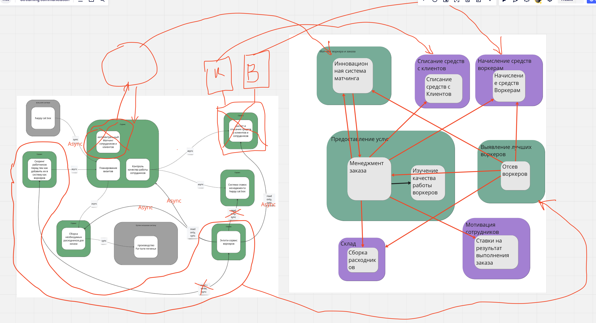

# Домашка №4

Возьмем схему системы из ДЗ и будем ее приводить к результату третьей домашки.

Изменения (список без какого-либо порядка, последовательность описана в конце домашки):

- Разбиваем сервис списания и начисления.
   Для этого используем схему Tactical Forking, так как не текущий момент у нас не расходятся
   ни данные, ни поведение. Мы сделаем две новые копии текщего сервиса. В один сервис перенесем информацию о списаниях, в другой о начислениях.
   Будем работать с постоянной синхронизацией данных на старом и новых сервисах. Постепенно будем убирать лишний код в новых сервисах.
   Когда лишнего кода не останется, мы сможем переключить трафик на новые сервисы и удалить старый сервис полностью.
   В самом конце перепишем коммуникации на асинхронные event-driven.

- Вынесем интеллектуальный матчинг из менеджмента заказов в отдельный сервис
   Для этого будет использовать Strangler Fig Application паттерн, поскольку нам нужен будет сервис с иным архтектурным стилем (Pipeline).
   Мы создадим новый сервис с нужной архитектурой и перенаправим к нему трафик из старого сервиса. Когда
   мы поймем, что новый сервис работает без ошибок, (т.е роллбэк на старый код уже не понадобится), то мы переключим трафик напрямую к новому сервису. Затем перестроим коммуникации на асинхронные event-driven и удалим лишние части из старого сервиса менеджмента заказов.

- Объединение тестирования воркеров и энтити сервиса воркеров
   Во первых, мы начнем создавать/изменять воркеров **дополнительно** в сервисе тестирования и синхронизируем данные с энтити сервисом воркеров. Далее создадим асинхронные стриминг-ивенты исходящие от сервиса тестирования об изменениях таблице воркеров. Начнем принимать эти стриминг ивенты во всех сервисах, где нужна информация о воркерах.
   Когда все сервисы смогут работать с ивентами, тогда мы сможем удалить энтити-сервис.

## Рассчитаем Instability

1. Старый сервис начисление и списания

   Есть 2 входящих связи от воркеров и менеджмента заказов и 0 исходящи, то есть Instability будет равно 0/(0 + 2) = 0
   У связанных сервисов Instability будет 1, поскольку есть исходящая запись и нет входящих.
   После разбиения на 2 отдельных сервиса Instability у этих сервисов не поменяется.

1. Энтити сервис воркеров

   Есть 5 исходящих связей во все остальные сервисы и есть одна входящая связь, то есть Instability = 5/5+1 ~ 0.83.

   У сервиса тестирования воркеров 1 входящая и 1 исходящая связи к сервису воркеров - то есть Instability = 0.5
   У остальных сервисов Инстабилити будет 0, так как нет исходящий записей.

   Когда мы объединим Энтити сервис воркеров и сервис тестирования воркеров, то у нового сервиса будут только 4 исходящие связи. Instability получится равной 1, так как нет входящих связей. Но мы избавляемся от 0.5 инстабилити отдельного сервиса тестирования.

1. Новый сервис интеллектуального матчинга

   Есть 1 исходящая связь к менеджменту заказов и 2 входящие (менеджмент заказа, воркеры). то есть Instability будет равно 1/(1 + 2) = 0.33

## Последовательность исправления, когда есть свободные люди и ресурсы, а опыта и (или) инфраструктуры нет

Когда у нас нет опыта или инфраструктуры, то необходимо получить этот опыт и настроить инфраструктуру с минимальными рисками для бизнеса.
Поэтому нужно начинать с самых простых вещей, а обычно это значит - с generic и supporting поддоменов.
На простых вещах разработчики наберутся опыта и построят инфраструктуру. Затем на этой основе можно будет изменять
более рискованные кор-поддомены.

Порядок:

- Разбиваем сервис оплаты и списаний. Это supporting поддомен с небольшим количеством связей (Instability = 0)
- Выносим сервис интеллектуального матчинга. Это уже core поддомен, но с небольшим количеством связей (Instability = 0.33)
- Объединяем entity сервис воркеров с их тестированием. Это тоже core поддомен, но с большим количеством связей (Instability = 1)

## Последовательность исправления, когда свободных людей и ресурса нет, а опыт и (или) готовая инфраструктура есть

Когда у бизнеса нет ресурсов, но есть инфрастуктура и опыт, то лучше начать с тех частей системы, которые помогут в кратчайшие
сроки повысить прибыль.

- Я полагаю, что система тормозит из-за синхронных запросов к ентити сервису воркеров от всех остальных сервисов. Поэтому
  не только лишь все хотят пользоваться нашей системой. Будем исправлять ентити сервис воркеров первым.

- Мы сможем оказывать услуги более качественно, если будем лучше матчить воркеров с заказами. Поэтому во вторую очередь вынесем именно
  сервис интеллектуального матчинга.

- И по остаточному принципу, разобъем сервис начислений и списаний, что поможет просто перестраховаться от проблем в будущем.
